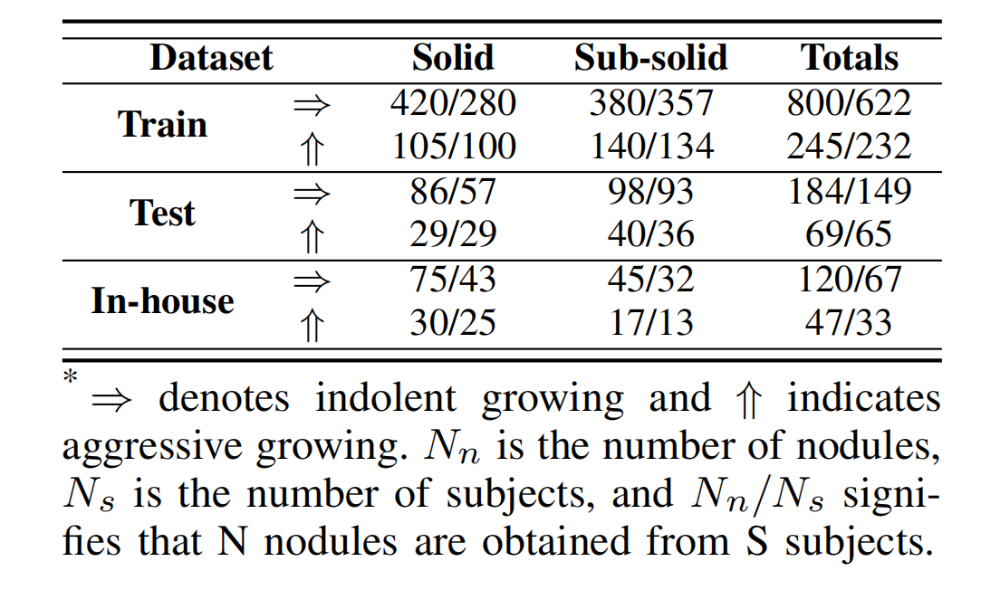
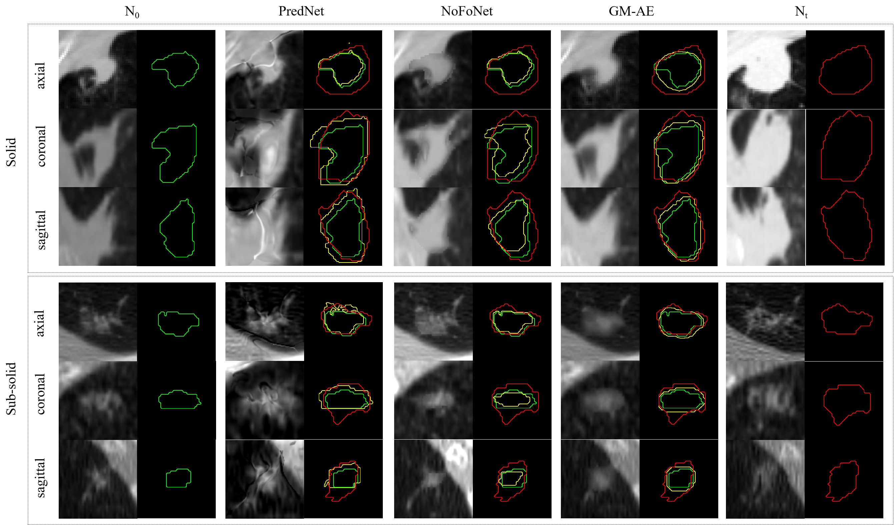

# GM-AE

## Introduction
This repository is an implementation of the paper '[Parameterized Gompertz-guided Morphological AutoEncoder for Predicting Pulmonary Nodule Growth]()', accepted by TMI.

<div align="center">
  
</div>
<p align="center">
  Gompertz network for volume and mass growth prediction on the baseline nodule over time.
</p>

<div align="center">
  
</div>
<p align="center">
  Architecture of morphological autoencoder equipped with shape-aware (DS) and texture-aware (DN ) decoders.
</p>


## Usage
### Training Gompertz:
Run
cd gompertz
python main_ddp.py --resume --gpu 1,2 --batch-size 16 --epochs 60 --distributed

### Training GM-AE：
cd gmae
python main_ddp.py

### Download trained models
Please download the trained models form [baidu](https://pan.baidu.com/s/1FatuhkeZldeHkigvMA85bQ), key is 'qntc', and place the downloaded models according to directory structure.

### Inference Gompertz:
Run
cd gompertz
python gompertz/inference.py

### Inference GM-AE：
cd gmae
python inference.py

## Datasets
Details of data processing in https://github.com/liaw05/STMixer
The paired nodules selected for this project is listed in './data/data.csv' (NLSTt), and please download raw CT scans from [NLST](https://wiki.cancerimagingarchive.net/display/NLST/National+Lung+Screening+Trial)

<div align="center">
  
</div>
<p align="center">
  STATISTICS (IN Nn/Ns) OF BENCHMARK SPLITS OF THE NLSTT DATASET AND IN-HOUSE DATASET*.
</p>


## Results
<div align="center">
  
</div>
<p align="center">
  The center three columns show the predicted texture (left) and shape (right, solid yellow line) of time points Nt by PredNet, NoFoNet, and our GM-AE.
</p>|


## License
This repository is released under the Apache 2.0 license as found in the [LICENSE](LICENSE) file.

## Citation

Please cite GM-AE in your publications if it helps your research. 

```

```

